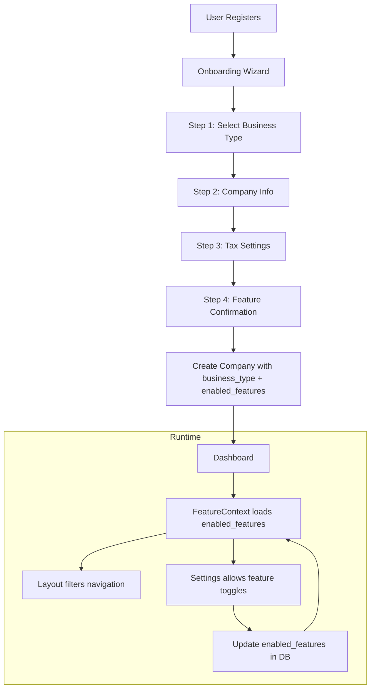

# Personalized Onboarding Experience

## Current State

- Single-step company setup form ([CompanyOnboarding.tsx](frontend/src/pages/CompanyOnboarding.tsx))
- All 20 navigation items shown to every user ([Layout.tsx](frontend/src/components/Layout.tsx))
- No business type or feature preferences stored
- No way to customize which features are visible

## Proposed Business Types

### 1. Solo Corporation (Contractor/Consultant)

For self-incorporated individuals with no employees to manage.

**Enabled Features:**

- Dashboard, Invoices, Income, Expenses, Capital Assets, Dividends, Clients, Reports
- Tax Calculator, Salary vs Dividend Optimizer, Owner Reimbursement, Settings

**Hidden Features:**

- Employees, Time Management, Pay Runs, Payroll Reports, Remittances, ROEs, T4 Generation, Salary

### 2. Small Business with Employees

For businesses that need full payroll and employee management.

**Enabled Features:**

- All features (same as current)

### 3. Professional Corporation (Suggested Addition)

For regulated professionals (doctors, lawyers, accountants, engineers).

**Enabled Features:**

- Same as Solo Corporation + professional income tracking considerations

### 4. Holding/Investment Company (Suggested Addition)

For passive income companies (rental properties, investments).

**Enabled Features:**

- Dashboard, Income, Expenses, Capital Assets, Dividends, Reports, Tax Calculator, Settings
- Focus on investment income, rental income, capital gains tracking

---

## Architecture

### Database Changes

Add to `companies` table via Supabase migration:

```sql
-- Business type enum
ALTER TABLE companies 
ADD COLUMN business_type TEXT DEFAULT 'solo_corporation' 
CHECK (business_type IN ('solo_corporation', 'small_business', 'professional_corporation', 'holding_company'));

-- Feature preferences (allows manual overrides)
ALTER TABLE companies 
ADD COLUMN enabled_features JSONB DEFAULT '{
  "invoices": true,
  "income": true,
  "expenses": true,
  "capital_assets": true,
  "dividends": true,
  "clients": true,
  "reports": true,
  "tax_calculator": true,
  "salary_dividend_optimizer": true,
  "owner_reimbursement": true,
  "employees": false,
  "time_management": false,
  "payroll": false,
  "salary": false
}'::jsonb;
```

### Feature Configuration

Create new file `frontend/src/lib/featureConfig.ts`:

```typescript
export type BusinessType = 'solo_corporation' | 'small_business' | 'professional_corporation' | 'holding_company';

export const BUSINESS_TYPE_LABELS = {
  solo_corporation: 'Solo Corporation',
  small_business: 'Small Business with Employees',
  professional_corporation: 'Professional Corporation',
  holding_company: 'Holding/Investment Company'
};

export const DEFAULT_FEATURES_BY_TYPE: Record<BusinessType, EnabledFeatures> = {
  solo_corporation: {
    invoices: true, income: true, expenses: true, capital_assets: true,
    dividends: true, clients: true, reports: true, tax_calculator: true,
    salary_dividend_optimizer: true, owner_reimbursement: true,
    employees: false, time_management: false, payroll: false, salary: false
  },
  small_business: {
    // All features enabled
  },
  // ... other types
};
```

---

## Multi-Step Onboarding Wizard

### Step 1: Welcome + Business Type Selection (NEW)

Beautiful card-based selection with icons and descriptions:

```
+------------------------------------------+
|  Welcome to CorpBooks!                   |
|  Let's personalize your experience       |
+------------------------------------------+

  +----------------+    +----------------+
  | [User Icon]    |    | [Team Icon]    |
  |                |    |                |
  | Solo           |    | Small Business |
  | Corporation    |    | with Employees |
  |                |    |                |
  | Perfect for    |    | Manage payroll,|
  | contractors &  |    | employees, and |
  | consultants    |    | time tracking  |
  +----------------+    +----------------+

  +----------------+    +----------------+
  | [Briefcase]    |    | [Building]     |
  |                |    |                |
  | Professional   |    | Holding/       |
  | Corporation    |    | Investment Co  |
  |                |    |                |
  | For regulated  |    | Passive income |
  | professionals  |    | & investments  |
  +----------------+    +----------------+
```

### Step 2: Company Information (Existing, refined)

- Company name
- Business number
- Province selection (NEW - auto-sets tax rates)
- Fiscal year end

### Step 3: Tax Settings (Existing, simplified)

- HST Registration toggle
- HST Filing Frequency (if registered)
- Tax rates (pre-filled based on province)

### Step 4: Feature Confirmation (NEW, optional quick view)

Show which features are enabled based on their selection:

```
Based on your selection, we've enabled these features:
[x] Dashboard    [x] Invoices    [x] Expenses
[x] Dividends    [x] Reports     [x] Tax Tools

You can always enable more features in Settings.
        [Get Started]
```

---

## File Changes

### 1. New Files to Create

- `frontend/src/lib/featureConfig.ts` - Feature configuration and defaults
- `frontend/src/contexts/FeatureContext.tsx` - Feature flag context provider
- `frontend/src/components/onboarding/BusinessTypeSelector.tsx` - Step 1 component
- `frontend/src/components/onboarding/CompanyInfoStep.tsx` - Step 2 component
- `frontend/src/components/onboarding/TaxSettingsStep.tsx` - Step 3 component
- `frontend/src/components/onboarding/FeatureConfirmation.tsx` - Step 4 component
- `frontend/src/components/onboarding/OnboardingWizard.tsx` - Main wizard container

### 2. Files to Modify

- [frontend/src/pages/CompanyOnboarding.tsx](frontend/src/pages/CompanyOnboarding.tsx) - Replace with multi-step wizard
- [frontend/src/components/Layout.tsx](frontend/src/components/Layout.tsx) - Filter navigation by enabled features
- [frontend/src/pages/Settings.tsx](frontend/src/pages/Settings.tsx) - Add feature management section
- [frontend/src/lib/api.ts](frontend/src/lib/api.ts) - Add business_type and enabled_features to Company interface
- [frontend/src/contexts/AuthContext.tsx](frontend/src/contexts/AuthContext.tsx) - Include enabled_features in user context

### 3. Database Migration

- Add `business_type` column to companies
- Add `enabled_features` JSONB column to companies

---

## Layout.tsx Navigation Changes

Filter navigation based on enabled features:

```typescript
const companyNavigation = [
  { name: 'Dashboard', href: '/', icon: Home, feature: null }, // always shown
  { name: 'Invoices', href: '/invoices', icon: FileText, feature: 'invoices' },
  { name: 'Employees', href: '/employees', icon: UserCircle, feature: 'employees' },
  { name: 'Pay Runs', href: '/payroll/runs', icon: DollarSign, feature: 'payroll' },
  // ... etc
];

// Filter by enabled features
const filteredNavigation = companyNavigation.filter(item => 
  item.feature === null || enabledFeatures[item.feature]
);
```

---

## Settings.tsx Feature Management

Add new section to toggle features on/off:

```
+------------------------------------------+
| Feature Management                        |
| Customize which features are visible      |
+------------------------------------------+

  Financial Management
  [x] Invoices           [x] Income
  [x] Expenses           [x] Capital Assets
  [x] Dividends          [x] Clients

  Payroll & Employees
  [ ] Employee Management    [ ] Time Tracking
  [ ] Pay Runs               [ ] Payroll Reports
  [ ] Remittances            [ ] T4 Generation

  Tools
  [x] Reports            [x] Tax Calculator
  [x] Salary vs Dividend Optimizer
```

---

## Additional UX Improvements (Suggestions)

### 1. Province Selection

Add province dropdown in Step 2 that auto-fills HST/GST rate:

- Ontario: 13% HST
- BC: 5% GST + 7% PST
- Alberta: 5% GST only
- Quebec: 5% GST + 9.975% QST

### 2. Progress Indicator

Show wizard progress at top: `Step 1 of 4 - Business Type`

### 3. Quick Start Actions (Post-Onboarding)

After completing onboarding, show a "What would you like to do first?" modal:

- Create your first invoice
- Add an expense
- Set up a client
- Explore the dashboard

### 4. Contextual Tooltips

Add `(?)` info icons with explanations for business types and complex fields.

### 5. Animation & Polish

- Smooth step transitions using framer-motion (already installed)
- Card hover effects on business type selection
- Success confetti/animation on completion

---

## Data Flow

