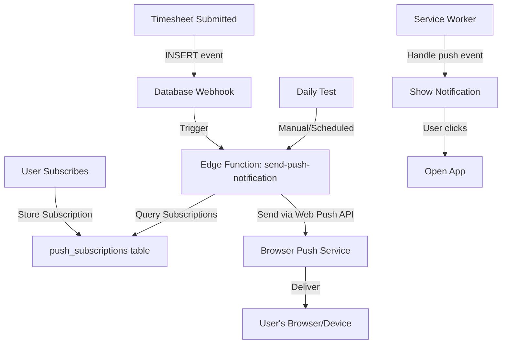

# Web Push Notification Implementation Plan

## Overview

Implement a complete Web Push notification system using Supabase Edge Functions. The system will send daily test notifications and be ready for future timesheet approval notifications. Uses event-driven database webhooks (zero cron costs) and Web Push API (industry standard).

## Architecture



## Implementation Steps

### 1. Update PWA Configuration

**File**: `frontend/vite.config.ts`

- Already has `vite-plugin-pwa` configured
- Need to add push notification support to workbox config
- Add `injectManifest` mode or extend `generateSW` to handle push events
- Configure service worker to handle push notifications

**Changes needed:**

- Add `injectManifest` strategy or custom service worker
- Configure push event handling in workbox

### 2. Create Custom Service Worker for Push

**File**: `frontend/src/service-worker.ts` (new)

- Handle `push` event - receive and display notifications
- Handle `notificationclick` event - open app when notification clicked
- Handle `pushsubscriptionchange` - resubscribe if subscription expires
- Store notification data for app to process

**Key handlers:**

```typescript
self.addEventListener('push', (event) => {
  // Parse notification data
  // Show notification with title, body, icon, badge
  // Handle notification data (type, id, url)
});

self.addEventListener('notificationclick', (event) => {
  // Open app to specific URL
  // Focus existing window or create new
});
```

### 3. Create PWA Icons

**Files**: `frontend/public/icon-192x192.png`, `frontend/public/icon-512x512.png`

- Generate 192x192 and 512x512 PNG icons
- Use existing app branding/colors
- Icons referenced in vite.config.ts manifest (already configured)

### 4. Database Schema

**Migration**: Create `push_subscriptions` table

- `id` (uuid, primary key)
- `user_id` (uuid, references auth.users, on delete cascade)
- `endpoint` (text, unique) - Web Push endpoint URL
- `p256dh` (text) - Public key for encryption
- `auth` (text) - Authentication secret
- `enabled` (boolean, default true)
- `created_at` (timestamptz)
- `updated_at` (timestamptz)
- Index on `user_id` for fast lookups
- RLS policies: users can only manage their own subscriptions

**SQL Migration:**

```sql
CREATE TABLE push_subscriptions (
  id uuid PRIMARY KEY DEFAULT gen_random_uuid(),
  user_id uuid REFERENCES auth.users(id) ON DELETE CASCADE NOT NULL,
  endpoint text NOT NULL UNIQUE,
  p256dh text NOT NULL,
  auth text NOT NULL,
  enabled boolean DEFAULT true,
  created_at timestamptz DEFAULT now(),
  updated_at timestamptz DEFAULT now()
);

CREATE INDEX idx_push_subscriptions_user_id ON push_subscriptions(user_id);
CREATE INDEX idx_push_subscriptions_enabled ON push_subscriptions(enabled) WHERE enabled = true;

ALTER TABLE push_subscriptions ENABLE ROW LEVEL SECURITY;

-- Users can only manage their own subscriptions
CREATE POLICY "Users can manage own subscriptions"
  ON push_subscriptions
  FOR ALL
  USING (auth.uid() = user_id);
```

### 5. Push Notification Utilities

**File**: `frontend/src/lib/pushNotifications.ts` (new)

- `isPushSupported()` - Check if browser supports push notifications
- `requestPermission()` - Request browser notification permission
- `subscribeToPush()` - Create push subscription using VAPID public key
- `unsubscribeFromPush()` - Unsubscribe and remove from database
- `getSubscriptionStatus()` - Check current subscription state
- `getStoredSubscription()` - Retrieve subscription from database
- Integration with Supabase API to store/retrieve subscriptions

**Key functions:**

```typescript
export async function subscribeToPush(vapidPublicKey: string): Promise<PushSubscription | null>
export async function unsubscribeFromPush(): Promise<void>
export async function getSubscriptionStatus(): Promise<'subscribed' | 'not-subscribed' | 'not-supported' | 'denied'>
```

### 6. API Integration

**File**: `frontend/src/lib/api.ts`

- Add methods to interact with push subscriptions:
  - `subscribeToPushNotifications(subscription: PushSubscriptionJSON)` - Store subscription
  - `unsubscribeFromPushNotifications(subscriptionId: string)` - Remove subscription
  - `getPushSubscriptionStatus()` - Get user's subscription status
  - `triggerTestNotification()` - Manual test trigger (optional)

**New API methods:**

```typescript
async subscribeToPushNotifications(subscription: PushSubscriptionJSON): Promise<void>
async unsubscribeFromPushNotifications(): Promise<void>
async getPushSubscriptionStatus(): Promise<{ subscribed: boolean; enabled: boolean }>
```

### 7. Settings UI Component

**File**: `frontend/src/pages/Settings.tsx`

- Add "Push Notifications" section after company settings
- Show subscription status (subscribed/not subscribed/not supported/denied)
- Toggle switch to enable/disable notifications
- Button to request permission and subscribe
- Button to unsubscribe
- Display last notification received time (optional, future enhancement)
- Handle permission states gracefully

**UI Components needed:**

- Card section for push notifications
- Status indicator (badge/icon)
- Enable/disable toggle
- Subscribe/Unsubscribe button
- Error/success messages

### 8. Supabase Edge Function

**File**: `supabase/functions/send-push-notification/index.ts` (new)

- Accept webhook payload or manual trigger
- Query `push_subscriptions` for target users
- Send push notifications using Web Push API with VAPID
- Handle errors (invalid subscriptions, cleanup expired)
- Log delivery status

**Function logic:**

- For timesheet notifications (future): Extract company_id, find owners, send to their subscriptions
- For daily test: Query all enabled subscriptions, send test notification
- Use `web-push` library (npm package available in Deno)
- Handle VAPID authentication
- Clean up invalid/expired subscriptions

**Key implementation:**

```typescript
import { createClient } from 'npm:@supabase/supabase-js@2'
import webpush from 'npm:web-push@latest'

// Send notification to subscription
// Handle errors and cleanup
```

### 9. VAPID Keys Setup

- Generate VAPID key pair using `web-push` library or online tool
- Store private key as Supabase secret: `VAPID_PRIVATE_KEY`
- Store public key in frontend env: `VITE_VAPID_PUBLIC_KEY`
- Add to `.env.production.example`

**Commands:**

```bash
# Generate VAPID keys (can use web-push generate-vapid-keys)
# Set secret in Supabase
npx supabase secrets set VAPID_PRIVATE_KEY=<private-key>
```

### 10. Database Webhook Setup (Future)

- For timesheet notifications: Create webhook in Supabase Dashboard
- Table: `timesheets` (when created)
- Event: `INSERT` where `status = 'pending'`
- Trigger: Edge Function `send-push-notification`
- Document setup but don't create yet (timesheet table doesn't exist)

### 11. Update Main Entry Point

**File**: `frontend/src/main.tsx`

- Register service worker for push notifications
- Initialize push notification system on app load
- Check subscription status and update UI

### 12. Environment Variables

**File**: `.env.production.example`

- Add `VITE_VAPID_PUBLIC_KEY` for frontend
- Document VAPID key generation process

## Files to Create

1. `frontend/src/service-worker.ts` - Custom service worker for push
2. `frontend/src/lib/pushNotifications.ts` - Push notification utilities
3. `supabase/functions/send-push-notification/index.ts` - Edge function
4. `frontend/public/icon-192x192.png` - PWA icon
5. `frontend/public/icon-512x512.png` - PWA icon

## Files to Modify

1. `frontend/vite.config.ts` - Update PWA config for push support
2. `frontend/src/pages/Settings.tsx` - Add push notification UI
3. `frontend/src/lib/api.ts` - Add subscription API methods
4. `frontend/src/main.tsx` - Initialize push notifications
5. `.env.production.example` - Add VAPID public key

## Dependencies

**Frontend:**

- `vite-plugin-pwa` - Already installed (v0.21.2)
- No additional packages needed (Web Push API is native)

**Edge Function:**

- `web-push` - npm package for Deno (import via `npm:web-push@latest`)

## Testing Checklist

- [ ] Service worker registers successfully
- [ ] PWA can be installed on mobile/desktop
- [ ] Push permission request works
- [ ] Subscription stored in database
- [ ] Daily test notification sends successfully
- [ ] Notification displays correctly
- [ ] Clicking notification opens app
- [ ] Unsubscribe works
- [ ] Handles permission denied gracefully
- [ ] Works on Chrome, Firefox, Edge
- [ ] RLS policies prevent unauthorized access
- [ ] Invalid subscriptions are cleaned up

## Security Considerations

- VAPID private key stored as Supabase secret (never exposed)
- RLS policies ensure users only access their own subscriptions
- HTTPS required for push notifications (production)
- Validate subscription endpoints before storing
- Clean up expired/invalid subscriptions
- Edge function verifies webhook authenticity

## Future Enhancements (Out of Scope)

- Notification preferences (types, frequency)
- Rich notifications with actions
- Notification history
- Integration with timesheet table (when implemented)
- Notification grouping/tagging
- Sound/vibration customization