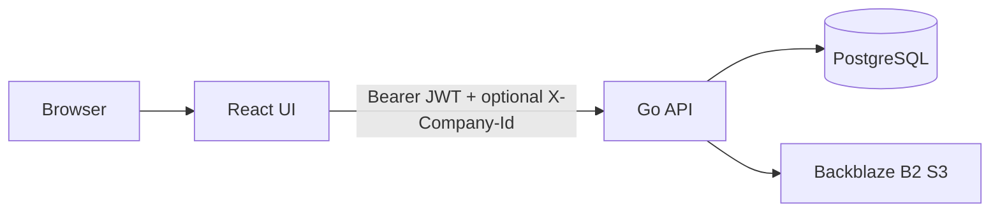

# Architecture

## Request flow

## Go API (`api/`)

| Area | Path | Notes |
|------|------|--------|
| Health | `GET /healthz`, `/health`, `/ready` | `/ready` pings DB |
| Auth | `POST /v1/auth/register`, `/login`, `/refresh`, `/forgot-password`, `/reset-password` | bcrypt + JWT pair + email-based reset |
| Auth (protected) | `GET /v1/auth/me`, `POST /v1/auth/update-password` | Session user + memberships or employee |
| Data | `POST /v1/data/{select,insert,update,delete,upsert}` | Table allowlists + scope rules in `internal/data` |
| Storage | `POST /v1/storage/presign-upload`, `presign-download`, `delete` | Disabled (503) if B2 env missing |
| Legacy parity | `/api/pay-myself`, `/api/company-members`, `/api/employees`, … | Ported from former Node service |

Current controlled cutover disables unported routes (`/api/ocr/*`, `/api/bank-statements/*`) and advertises those capabilities as unavailable from `/v1/features`. Frontend components consume these flags and gracefully disable unsupported workflows.

## Configuration (12-factor)

| Variable | Purpose |
|----------|---------|
| `DATABASE_URL` | Postgres connection string |
| `JWT_SECRET` | HMAC secret (min 32 chars) |
| `HTTP_ADDR` | Listen address (default `:8080`) |
| `FRONTEND_URL` / `FRONTEND_URLS` | CORS allowlist |
| `RUN_MIGRATIONS` | Set `false` to skip migrate on boot |
| `MIGRATIONS_PATH` | e.g. `file://migrations` |
| `B2_S3_ENDPOINT`, `B2_REGION`, `B2_BUCKET`, `B2_KEY_ID`, `B2_APPLICATION_KEY` | Optional B2 |
| `RESEND_API_KEY`, `RESEND_FROM_EMAIL` | Invoice / mail |
| `GEMINI_API_KEY` | OCR (when ported) |
| `VAPID_*` | Web push |
| `OPTIMIZER_SCRIPT` | Path to pay-myself Node script if used |

Copy `api/.env.example` as a starting point.

## Authorization

- JWT **subject** is `app_users.id` (UUID), matching `profiles.auth_user_id` and `employees.auth_user_id`.
- Middleware loads `internal/ctx.User` (profile + memberships + company IDs, or employee + company).
- `/v1/data/*` enforces table-level rules (company scope, membership, employee portal) in Go — **not** Postgres RLS in the browser.
- Storage keys must start with `{company_id}/` and the user must have access to that company.

## Auth hardening roadmap

The auth system remains in-app in the Go API and is hardened incrementally with library-first controls:

1. Keep JWT signing/parsing on `github.com/golang-jwt/jwt/v5` and password hashing on `bcrypt`.
2. Add server-side refresh session persistence in Postgres (token family, rotation, revocation, reuse detection).
3. Enforce strict claim validation (`iss`, `aud`, `exp`, `nbf`, `iat`, `jti`, token type).
4. Keep endpoint-level rate limits and brute-force protections for auth routes (shared DB state in `auth_rate_limits`).
5. Emit audit events for login/refresh/logout/password-change/revocation, including request metadata.

Design decision references:

- `docs/decisions/ADR-Auth-InApp-Library-Strategy.md`
- `docs/AUTH_SQL_AGENT_PLAYBOOK.md`

## SQL access standard

Default SQL stack:

- `pgx` + `pgxpool` for connections and execution
- `sqlc` for typed domain query generation
- `golang-migrate` for schema changes in `api/migrations/`

Guidelines:

- Core domain and auth paths should prefer `sqlc + pgx` over ORM abstractions.
- Dynamic query surfaces (such as `/v1/data/*`) must use strict allowlists and reject invalid query inputs.
- Multi-step writes that must be atomic should use transactions.
- `gorm` is not a default for core paths; exceptions must be isolated and documented.

## Frontend

- `supabaseClient.ts` exports `createGoClient(API_URL)` as `supabase` for gradual migration of call sites.
- New work should prefer typed fetch helpers or OpenAPI-generated clients when available.

## Deploy (Coolify)

- Build API from `api/Dockerfile` (multi-stage Go build).
- Attach managed Postgres; set `DATABASE_URL` and secrets in Coolify.
- Point the UI `VITE_API_URL` at the public API URL.
