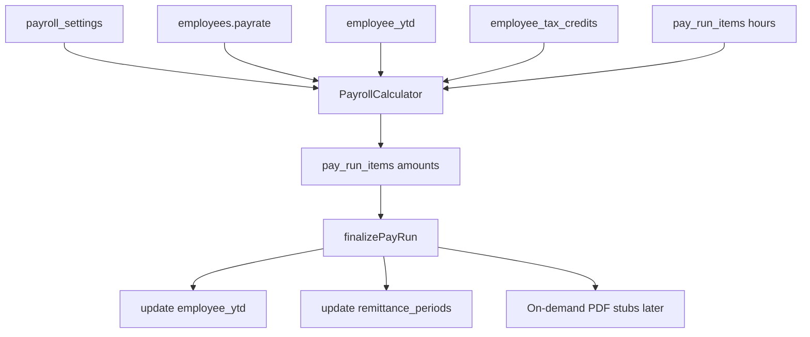

# Payroll Improvement Plan — Phase 1 (Usability) + Phase 2 (Tax Accuracy)

**Audience:** Implementing agent (no prior chat context required)  
**Product:** Cashual / corporate accounting app (`c:\projects\accounting`)  
**Goal:** Make Ontario payroll runnable by a typical owner (Phase 1), then make withholdings trustworthy enough for remittance demos (Phase 2).  
**Out of scope for this plan:** Direct deposit, CRA XML e-file, multi-province expansion, full T4032 rewrite (called out as Phase 3 later).

---

## ALREADY DONE — keep these changes (do not revert)

A prior agent **deprecated the legacy Salary ledger** in favor of Pay Runs. These edits may still be **uncommitted** in the working tree. **Keep them.** Build Phase 1–2 on top; do not restore the Salary nav item or switch Dashboard/Reports back to the `salaries` table.

### Product decision (keep)
- **Employees** = pay *rate* (set once): `payrate` / `payrate_type`
- **Pay Runs** = actual payroll payments (taxed periods)
- **Salary page** (`/salary`, `salaries` table) = legacy manual payment log — **deprecated**, unused (0 rows in live DB at review time)

### What was already changed

| Change | Files |
|--------|--------|
| Removed **Salary** from sidebar nav | [`frontend/src/components/Layout.tsx`](frontend/src/components/Layout.tsx) |
| `/salary` soft-redirects to `/payroll/runs` | [`frontend/src/App.tsx`](frontend/src/App.tsx) |
| `salary` feature default `false`; dropped from payroll feature group; force-disabled in FeatureContext | [`frontend/src/lib/featureConfig.ts`](frontend/src/lib/featureConfig.ts), [`frontend/src/contexts/FeatureContext.tsx`](frontend/src/contexts/FeatureContext.tsx) |
| Cleared `enabled_features.salary` for company that had it on (Supabase) | Live DB — company `yoyo` id 51 → `salary: false` |
| Timesheet push deep link `/salary` → `/time-management` | [`backend/src/routes/pushNotificationRoutes.js`](backend/src/routes/pushNotificationRoutes.js) |
| Shared helpers: `getPayrollExpenseForPeriod`, `getEmployeePayrollGrossForPeriod` | [`frontend/src/lib/api.ts`](frontend/src/lib/api.ts) |
| Dashboard / Reports / Tax Summary use **finalized pay-run employer cost**, not `salaries` | [`frontend/src/pages/Dashboard.tsx`](frontend/src/pages/Dashboard.tsx), [`Reports.tsx`](frontend/src/pages/Reports.tsx), [`TaxCalculator.tsx`](frontend/src/pages/TaxCalculator.tsx) |
| Pay Myself / compensation YTD salary from pay_run_items gross | [`frontend/src/lib/api.ts`](frontend/src/lib/api.ts) `getYtdIncome`, [`backend/src/routes/payMyselfRoutes.js`](backend/src/routes/payMyselfRoutes.js), [`backend/src/services/compensationStrategyService.js`](backend/src/services/compensationStrategyService.js) |
| Safe-to-spend / fiscal net income uses payroll expense helper | [`frontend/src/lib/api.ts`](frontend/src/lib/api.ts) |
| Employees pay-rate helper: “used by Pay Runs to calculate pay” | [`frontend/src/pages/Employees.tsx`](frontend/src/pages/Employees.tsx) |
| Playwright: smoke no longer expects Salary nav; `salary.spec` checks redirect | [`playwright-ui/tests/smoke.spec.ts`](playwright-ui/tests/smoke.spec.ts), [`playwright-ui/tests/salary.spec.ts`](playwright-ui/tests/salary.spec.ts), [`playwright-ui/tests/helpers/nav.ts`](playwright-ui/tests/helpers/nav.ts) |

### Explicitly left alone (do not delete in Phase 1–2)
- [`frontend/src/pages/Salary.tsx`](frontend/src/pages/Salary.tsx) and `salaries` table / `api.getSalaries` CRUD — unused, keep for later cleanup
- Public **Salary vs Dividend** calculator (`/salary-vs-dividend-calculator`) — unrelated tool; keep

### Agent rules for this prior work
1. **Do not reintroduce** Salary in `Layout` or `FEATURE_GROUPS.payroll`
2. **Do not** switch financial totals back to `getSalaries` — keep using `getPayrollExpenseForPeriod` / employee gross helpers
3. If adding new P&L / tax / YTD salary expense, use the pay-run helpers
4. User may want these committed separately before Phase 1 — ask before committing

---

**Related context:**
- Live DB (project `lxuvaxqkmwwoabyfokjd`) had **0 pay runs** and **0 `payroll_settings`** rows at review time — cold-start is untested.
- Review canvas (optional): `~/.cursor/projects/c-projects-accounting/canvases/payroll-implementation-review.canvas.tsx`

**Stack notes:**
- Frontend: React + TypeScript + Vite + TanStack Query + Supabase client
- Payroll math runs **client-side** in `frontend/src/lib/payrollCalculations.ts` via `api.calculatePayRunItem` in `frontend/src/lib/api.ts`
- DB changes: use **Supabase MCP** (`apply_migration` / `execute_sql`) per `AGENTS.md` — do **not** invent local SQL migration files as source of truth
- UI: follow `frontend/DESIGN_SYSTEM.md` (semantic colors, `Button`/`Card`, `.input` class)

---

## Success criteria

### Phase 1
- [ ] Owner with `payroll` enabled can complete draft → calculate → finalize without hitting “Payroll settings not found”
- [ ] Pay period start/end/pay date are editable before and after create (while draft)
- [ ] Calc/finalize/submit errors show in UI (toast or inline), not silent console-only
- [ ] ROE create from list works (employee picker)
- [ ] Void pay run reverses YTD **and** remittance period totals
- [ ] Solo-owner path: finalize without mandatory separate “approve as someone else” friction (see below)
- [ ] Vacation / other earnings editable on pay run items (at least basic fields)

### Phase 2
- [ ] 2026 `tax_rates` / `tax_constants` / provincial constants match CRA (and `canadaTaxEngine.ts` where overlapping)
- [ ] Unit test mocks updated to same numbers
- [ ] At least 3–5 golden PDOC-style asserts (exact dollars within $1) for known scenarios
- [ ] Document remaining gaps vs full T4032 (what is still approximate)

---

## Architecture (current happy path)

---

# Phase 1 — Usability (do first)

Estimated effort: 2–4 days depending on polish.

## 1.1 Auto-provision Payroll Settings + gate Pay Runs

**Problem:** `api.calculatePayRunItem` throws if `getPayrollSettings` returns null. Live DB had 0 settings rows.

**Files:**
- [`frontend/src/components/settings/PayrollSettings.tsx`](frontend/src/components/settings/PayrollSettings.tsx) — defaults already exist in form state
- [`frontend/src/lib/api.ts`](frontend/src/lib/api.ts) — `getPayrollSettings` / `createPayrollSettings`
- [`frontend/src/pages/PayRuns.tsx`](frontend/src/pages/PayRuns.tsx)
- [`frontend/src/pages/PayRunDetail.tsx`](frontend/src/pages/PayRunDetail.tsx)

**Implement:**
1. Add `api.ensurePayrollSettings(companyId)` that:
   - Returns existing settings if present
   - Otherwise creates defaults matching `PayrollSettings.tsx` form defaults (`biweekly`, `ON`, OT 44h @ 1.5x, vacation 4%/6%, remitter `regular`, 8h/5d)
2. Call `ensurePayrollSettings` when:
   - Opening Pay Runs list / creating a pay run
   - Opening Payroll Settings page (so form always has a row)
3. On Pay Runs list, if settings were just auto-created, show a one-time banner: “Default payroll settings applied — review in Settings → Payroll”
4. Before calculate, if settings still missing, show a blocking Card with link to `/settings/payroll` (should be rare after ensure)

**Do not** silently change province away from ON without UI — defaults stay ON for Phase 1.

---

## 1.2 Create wizard + editable pay period dates

**Problem:** Navigating to `/payroll/runs/new` immediately inserts a draft with hardcoded dates (today−14 / today−7 / today). Dates are display-only. Save calls `updateMutation.mutate({})` (no-op).

**Files:**
- [`frontend/src/pages/PayRunDetail.tsx`](frontend/src/pages/PayRunDetail.tsx)
- [`frontend/src/pages/PayRuns.tsx`](frontend/src/pages/PayRuns.tsx)
- [`frontend/src/lib/api.ts`](frontend/src/lib/api.ts) — `createPayRun` (overlap + pay_date ≥ period_end validation)

**Implement:**
1. Change create flow:
   - “Create New Pay Run” opens a **modal** (or dedicated create panel) with:
     - `pay_period_start`, `pay_period_end`, `pay_date` (required date inputs)
     - Prefill from payroll settings frequency (e.g. biweekly: end = start+13 days, pay_date = end or end+few days — pick a simple rule and document it)
   - Only call `createPayRun` on confirm
2. On draft detail page, make the three dates **editable** inputs; wire Save to `updatePayRun` with those fields
3. Remove no-op Save / or make Save actually persist date edits
4. Surface overlap / validation errors from `createPayRun` in the modal

**Suggested biweekly prefill:**  
`end = start + 13 days`, `pay_date = end` (owner can change).

---

## 1.3 Solo-owner finalize shortcut + visible errors

**Problem:** Solo owners must Submit → Approve → Finalize. Mutation failures are often silent.

**Files:**
- [`frontend/src/pages/PayRunDetail.tsx`](frontend/src/pages/PayRunDetail.tsx)
- Existing workflow methods in `api.ts`: `submitPayRunForApproval`, `approvePayRun`, `finalizePayRun`, `returnPayRunToDraft`

**Implement:**
1. Add primary button on **draft** (when validation errors empty): **“Calculate & Finalize”** that:
   - Ensures all items calculated (`calculateAllPayRunItems`)
   - Transitions draft → approved → finalized in sequence (reuse existing API methods)
   - Keep existing Submit / Approve buttons for multi-user companies (do not remove)
2. Add `onError` handlers for all pay-run mutations: show user-visible error (existing toast/alert pattern in app — prefer inline `AlertCircle` banner on the page over `alert()` if a pattern exists; otherwise use a clear error state string at top of `PayRunDetail`)
3. Debounce hours `onChange` recalculation (300–500ms) to avoid per-keystroke races in `PayRunItemsTable` / detail

---

## 1.4 Earnings fields on pay run items

**Problem:** Model supports vacation/sick/stat/other earnings; UI only edits regular + OT. Calculator path does not always pass `otherEarnings`.

**Files:**
- [`frontend/src/components/payroll/PayRunItemsTable.tsx`](frontend/src/components/payroll/PayRunItemsTable.tsx)
- [`frontend/src/components/payroll/PayRunItemDetail.tsx`](frontend/src/components/payroll/PayRunItemDetail.tsx)
- [`frontend/src/lib/api.ts`](frontend/src/lib/api.ts) — `calculatePayRunItem`, `updatePayRunItem`
- [`frontend/src/lib/payrollCalculations.ts`](frontend/src/lib/payrollCalculations.ts)

**Implement (minimum):**
1. Allow editing on draft items:
   - `vacation_hours_used`
   - `statutory_holiday_hours` (if column exists)
   - `other_earnings` (dollar amount)
2. Pass `otherEarnings` into `PayrollCalculator.calculate(...)` from `calculatePayRunItem`
3. Recalculate after those field updates (same debounce as hours)

Sick hours can remain unpaid/ignored if engine already ignores them — document in UI helper text (“Sick hours tracked; unpaid in this version”) if shown.

---

## 1.5 ROE create: employee picker

**Problem:** [`ROEList.tsx`](frontend/src/pages/ROEList.tsx) navigates to `/payroll/roe/new` without `?employee=`. [`ROEGeneration.tsx`](frontend/src/pages/ROEGeneration.tsx) requires `employeeId`.

**Implement:**
1. On “Create ROE”, open a small modal/select of employees (prefer inactive/terminated first, but allow any)
2. Navigate to `/payroll/roe/new?employee={id}` after selection
3. If `/new` loads without employee, show picker instead of empty broken form

---

## 1.6 Void UI + reverse remittance on void

**Problem:** `api.voidPayRun` reverses YTD but does **not** reverse remittance. No void button in UI.

**Files:**
- [`frontend/src/lib/api.ts`](frontend/src/lib/api.ts) — `voidPayRun`, `updateRemittancePeriodOnFinalize`
- [`frontend/src/pages/PayRunDetail.tsx`](frontend/src/pages/PayRunDetail.tsx)

**Implement:**
1. Add private `reverseRemittancePeriodOnVoid(payRun)` mirroring finalize math (subtract employer/employee source deductions that were added)
2. Call it from `voidPayRun` after YTD reverse
3. On finalized pay run detail: **Void** button → confirm + required reason → call `voidPayRun`
4. Guard: only `finalized` can void (already in API)

---

## 1.7 Journal entry double-count fix

**Problem:** `getPayrollJournalEntry` debits wages = `total_gross` then adds OT/vacation expense again.

**File:** [`frontend/src/lib/api.ts`](frontend/src/lib/api.ts) (`getPayrollJournalEntry`)

**Implement:** Make JE balance correctly:
- Debit wage expense once for gross (or split regular/OT/vacation **without** also debiting full gross)
- Credits: net pay payable, CPP/EI/tax payable, employer CPP/EI expense as appropriate
- Add a small unit/integration assert: `total_debit === total_credit` (within 0.01)

---

## 1.8 (Optional polish if time) Payroll nav hub

Collapse sidebar items into one “Payroll” entry with sub-routes or in-page tabs.  
**Lower priority than 1.1–1.7** — skip if timeboxed; do not block Phase 2.

---

# Phase 2 — Tax accuracy (light CRA trust)

Estimated effort: 2–4 days. **Does not** fully implement T4032; corrects wrong seeds and adds golden tests.

## 2.1 Correct 2026 seed data in Supabase

**Problem:** Live `tax_rates` / `tax_constants` for 2026 disagree with CRA and with [`frontend/src/lib/canadaTaxEngine.ts`](frontend/src/lib/canadaTaxEngine.ts).

**Authoritative 2026 targets (from `canadaTaxEngine.ts` + CRA audit):**

### Federal brackets 2026
| min | max | rate |
|-----|-----|------|
| 0 | 58523 | 14% |
| 58523.01 | 117045 | 20.5% |
| 117045.01 | 181440 | 26% |
| 181440.01 | 258482 | 29% |
| 258482.01 | null | 33% |

**Wrong today (examples):** upper brackets using 117037 / 161087 / 246752 instead of 117045 / 181440 / 258482.

### Ontario brackets 2026
| min | max | rate |
|-----|-----|------|
| 0 | 53891 | 5.05% |
| 53891.01 | 107785 | 9.15% |
| 107785.01 | 150000 | 11.16% |
| 150000.01 | 220000 | 12.16% |
| 220000.01 | null | 13.16% |

**Wrong today:** 51446 / 102894 as first brackets.

### Tax constants 2026
| Field | Target | Wrong today |
|-------|--------|-------------|
| `cpp_max_contribution` | **4230.45** | 4237.95 |
| `cpp_ympe` | 74600 | OK |
| `cpp2_yampe` / max | verify vs CRA (engine uses YAMPE 85000; cpp2 max ~416) | verify |
| EI rate / MIE / max premium | verify vs T4032-ON 2026 | EI 1.63% / 68900 / 1123.07 reportedly OK |

### Provincial surtax thresholds
Verify `provincial_tax_constants` for ON 2026:
- surtax thresholds should be tax-amount thresholds (~5818 / ~7446), **not** income bracket tops (220000 / 253415 was reported wrong for 2025 — check 2026 rows)

**Implement via Supabase MCP:**
1. `execute_sql` to inspect current 2026 rows
2. `apply_migration` named e.g. `fix_2026_tax_tables_cra` that UPDATEs/replaces 2026 federal + ON brackets and constants
3. Re-read rows to verify
4. Run `get_advisors type=security` after if schema touched (data-only update is fine)

Also update matching mocks in:
- [`frontend/src/lib/__tests__/payrollCalculations.test.ts`](frontend/src/lib/__tests__/payrollCalculations.test.ts)
- [`frontend/src/lib/__tests__/testScenarios.ts`](frontend/src/lib/__tests__/testScenarios.ts) if present

Default TD1 fallbacks in `calculatePayRunItem` (`15705` / `12866`) — align with 2026 BPA used in `tax_constants` / CRA / `canadaTaxEngine` (`FEDERAL_BPA_MAX` 16452, `ONTARIO_BPA` 12989) or load from DB constants instead of hardcoding.

---

## 2.2 Golden PDOC-style tests (minimum set)

**File:** extend [`frontend/src/lib/__tests__/payrollCalculations.test.ts`](frontend/src/lib/__tests__/payrollCalculations.test.ts)

Add at least these scenarios with **exact** expected CPP/EI/tax/net within **$1**:

1. Biweekly Ontario, hourly, mid income, no YTD, standard TD1  
2. Same employee near CPP YMPE (YTD almost maxed) → CPP near 0  
3. High earner triggering CPP2  
4. Overtime period (verify gross and that OT rate 1.5x)  
5. Zero hours → zeros  

Document source of expected values in test comments (CRA PDOC screenshot / spreadsheet / `canadaTaxEngine` cross-check). If full PDOC unavailable, derive expected from corrected brackets with a spreadsheet and note “internal golden — replace with PDOC when available”.

---

## 2.3 Document remaining tax gaps (Phase 3 preview)

Add short section to this file or `roadmap/Payroll-Management-System/TAX-ENGINE-GAPS.md`:

Still approximate after Phase 2:
- Not full CRA T4032 Formula (claim codes, K' constants, pay-period factors)
- Canada Employment Amount / ON tax reduction / ON Health Premium may be missing or unused in `PayrollCalculator`
- Enhanced CPP credit vs deduction split may differ from `canadaTaxEngine.ts`
- Employer CPP2 may be missing
- QC / other provinces unsupported
- Client-side finalize (not atomic server transaction)

**Do not** attempt full T4032 rewrite in Phase 2.

---

## 2.4 (Stretch) Align payroll calculator with canadaTaxEngine pieces

Only if Phase 2 core is done and time remains:
- Reuse bracket constants from one shared module to prevent dual-source drift
- Or have `createPayrollCalculator` load DB rates that Phase 2 corrected (already the path) and delete duplicated wrong mocks

Prefer **single source of truth**: DB rates for pay runs; `canadaTaxEngine` for annual planners — keep both consistent via migration + shared constant export if easy.

---

# Explicit non-goals (do not implement in Phase 1–2)

- **Reverting the Salary deprecation** (see ALREADY DONE above)
- Direct deposit / EFT / bank files
- CRA My Business Account payment / T4 XML / ROE Web e-file
- Quebec QPP / multi-province tax tables
- Dropping `salaries` table / deleting `Salary.tsx` (leave for later cleanup)
- Moving calculate/finalize to Express backend (nice later; not required here)
- Full T4032 payroll engine rewrite

---

# Implementation order (for the agent)

1. Phase 1.1 settings ensure + gate  
2. Phase 1.2 create modal + editable dates  
3. Phase 1.3 errors + Calculate & Finalize  
4. Phase 1.5 ROE picker (small, high value)  
5. Phase 1.6 void UI + remittance reverse  
6. Phase 1.4 earnings fields + otherEarnings wiring  
7. Phase 1.7 journal balance fix  
8. Phase 2.1 Supabase tax migration + mock updates  
9. Phase 2.2 golden tests  
10. Phase 2.3 gap doc  

Commit in logical chunks (Phase 1 vs Phase 2) if the user requests commits — **do not commit unless asked**.

---

# Verification checklist

### Manual (Phase 1)
1. Company with payroll feature, no `payroll_settings` row → open Pay Runs → settings auto-created  
2. Create pay run via modal with custom dates → detail shows those dates  
3. Edit dates on draft → Save → reload persists  
4. Add employee with payrate → enter hours → Calculate All → amounts non-zero  
5. Calculate & Finalize → status finalized; YTD row exists; remittance period updated  
6. Void → YTD reduced; remittance reduced; status void  
7. ROE list → Create → pick employee → form loads  
8. Intentionally break calc (e.g. missing rate) → error visible on page  

### Automated (Phase 2)
1. `npx vitest run src/lib/__tests__/payrollCalculations.test.ts` (from `frontend/`)  
2. SQL verify 2026 brackets/constants match targets above  

### Playwright (if touching nav/flows)
- Update [`playwright-ui/tests/pay-runs.spec.ts`](playwright-ui/tests/pay-runs.spec.ts) for create modal if needed  
- ROE / void coverage only if specs already exist; otherwise manual OK  

---

# Key file index

| Area | Path |
|------|------|
| Pay runs UI | `frontend/src/pages/PayRuns.tsx`, `PayRunDetail.tsx` |
| Items / add employee | `frontend/src/components/payroll/PayRunItemsTable.tsx`, `AddEmployeeToPayRun.tsx` |
| Calculator | `frontend/src/lib/payrollCalculations.ts` |
| API / finalize / void / JE | `frontend/src/lib/api.ts` |
| Settings UI | `frontend/src/components/settings/PayrollSettings.tsx` |
| Better annual tax reference | `frontend/src/lib/canadaTaxEngine.ts` |
| Tests | `frontend/src/lib/__tests__/payrollCalculations.test.ts` |
| ROE | `frontend/src/pages/ROEList.tsx`, `ROEGeneration.tsx` |
| Remittances UI | `frontend/src/pages/PayrollRemittances.tsx` |
| Feature flags | `frontend/src/lib/featureConfig.ts` |
| Design system | `frontend/DESIGN_SYSTEM.md` |
| Agent DB rules | `AGENTS.md` |

---

# Definition of done

Phase 1 + Phase 2 are done when:
- An Ontario small-business owner can configure (or auto-get) settings, create a dated pay run, calculate, finalize, void correctly, and create an ROE without dead ends
- 2026 tax seeds match CRA targets above and golden tests pass
- Remaining T4032 gaps are documented for a future Phase 3
